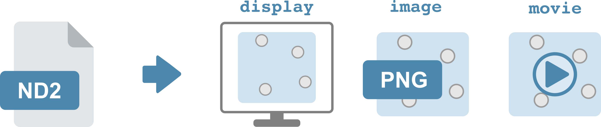

[](https://github.com/FrickTobias/nd2tools/actions/workflows/ci_linux.yml) [](https://github.com/FrickTobias/nd2tools/actions/workflows/ci_macos.yml)

Extracts images and movies from nd2 files.



Feel free to post suggestions of what functionality to add by [opening an issue](https://github.com/FrickTobias/nd2tools/issues/new).

# Requirements

Install
miniconda [according to their instructions](https://docs.conda.io/en/latest/miniconda.html)
or use the script in this git repo.

```
bash install-miniconda.sh
```

# Installing

Run this in your terminal.
```
git clone https://github.com/FrickTobias/nd2tools.git 
conda env create -n ndt -f nd2tools/environment.yml 
conda activate ndt
pip install -e nd2tools 
```

Updating
```
git -C path/to/nd2tools pull
```

# Usage

See `nd2tools -h` and `nd2tools [display|image|movie] -h` .

## Examples

Write image
```
nd2tools image --input-file cells.nd2 --output-folder images
```

Make movie
```
nd2tools movie --input-file cells.nd2 --output-folder movies
```

